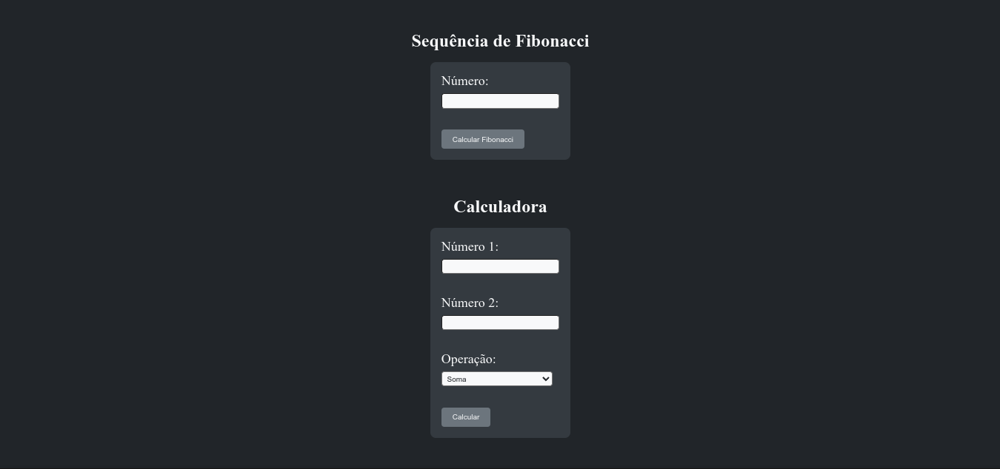
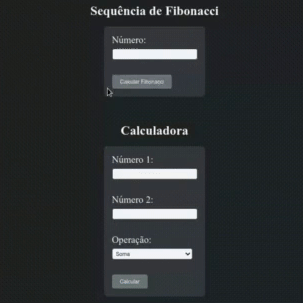

# Fibonacci e Calculadora



### Atividade:
1. Escreva um script PHP para exibir a sequência de Fibonacci no navegador.
Atenção: Inicie o servidor Web para que o resultado desse script seja exibido.

2. Criar uma calculadora com HTML e PHP. Operações:
- Soma, subtração, multiplicação e divisão.
- Utilize dois números nas operações.
- Utilize funções.
- Utilize requisições para enviar os números e a operação desejada.

### O que foi feito:
Este é um projeto que inclui uma calculadora simples e uma função para exibir a sequência de Fibonacci. O projeto utiliza HTML, PHP  e Docker para executar um servidor web localmente.

<p align="center">
  
</p>

## Instruções

Siga as etapas abaixo para configurar e executar o projeto localmente.

### Pré-requisitos

Certifique-se de ter o Docker instalado e configurado em sua máquina. Você pode encontrar instruções para instalação do Docker em: [https://docs.docker.com/get-docker/](https://docs.docker.com/get-docker/)

### Passo 1: Clone o repositório

Clone este repositório em sua máquina local:

```bash
git clone https://github.com/jlss14-ifal/PROW2023.git
```

### Passo 2: Navegue até o diretório

Navegue até o diretório do projeto:

```bash
cd PROW2023/fibonacci-calculadora
```

### Passo 3: Construa a imagem Docker

Construa a imagem Docker a partir do Dockerfile fornecido:

```bash
docker build -t fibonacci-calculadora .
```

### Passo 4: Execute o contêiner

Execute o contêiner Docker usando o nome `fibonacci-calculadora`:

```bash
docker run -d -p 8080:80 fibonacci-calculadora
```

### Passo 5: Acesse o aplicativo

Abra o navegador e acesse [http://localhost:8080](http://localhost:8080) para acessar a sequência de Fibonacci e a calculadora.

## Arquivos

O projeto inclui os seguintes arquivos:

- `index.html`: O arquivo HTML principal que contém a interface da sequência de Fibonacci e da calculadora.
- `style.css`: O arquivo CSS que fornece o estilo para a interface.
- `calculadora.php`: O script PHP que processa os dados enviados pela calculadora e retorna o resultado.
- `fibonacci.php`: O script PHP que gera a sequência de Fibonacci com base no número fornecido.
- `resultado.php`: O arquivo PHP que exibe o resultado da operação da calculadora ou da sequência de Fibonacci.
- `Dockerfile`: O arquivo de configuração do Docker para criar a imagem do contêiner.

## Licença

Este projeto está licenciado sob a Licença MIT.
